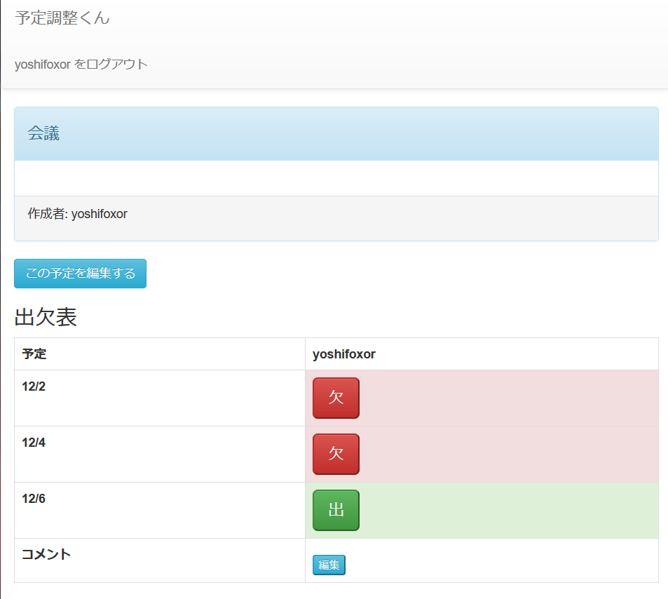

# schedule-arranger

スケジュール調整アプリ

# DEMO

# Requirement

* Node.js 8 or later.
* PostgreSql

# Usage

- Fork and clone  or Download this repositoty.

- cd schedule-arranger
- npm install
- npm start
